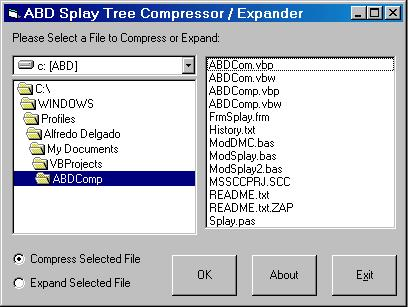



## Splay Tree Version 2\.0

### Description

Single File Compression using splay trees an improved version I have submitted last 6 days ago.

It also teach the use of drive list box, file list box and dir list box. Further explanation are

found in the code and readme. It just illustrate a compression routine that can be embedded in your programs fast enough but with good compression ratio. Error handling is not implemented yet so be careful when compressing and

expanding files.
 
### More Info
 
File Name to be compressed or expanded

Warning: Backup your data before using with this program. The code may contain bugs undetected by my testing.

Compress file or Expanded file

It overwrites the file name specified or selected without any prior notice. Error handling is not implemented yet. So be careful.

             |
---                |---
**Submitted On**   |2002-12-24 00:24:30
**By**             |[Alfredo Delgado](https://github.com/Planet-Source-Code/PSCIndex/blob/master/ByAuthor/alfredo-delgado.md)
**Level**          |Intermediate
**User Rating**    |4.7 (14 globes from 3 users)
**Compatibility**  |VB 6\.0
**Category**       |[Miscellaneous](https://github.com/Planet-Source-Code/PSCIndex/blob/master/ByCategory/miscellaneous__1-1.md)
**World**          |[Visual Basic](https://github.com/Planet-Source-Code/PSCIndex/blob/master/ByWorld/visual-basic.md)
**Archive File**   |[Splay\_Tree15182012252002\.zip](https://github.com/Planet-Source-Code/alfredo-delgado-splay-tree-version-2-0__1-41837/archive/master.zip)

